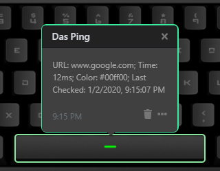

# Q Applet: Das Ping

Das Ping is a Das Keyboard Applet that periodically pings a website and assigns a color to a key based on the response time. The colors and timings are configurable. It works well for monitoring downtime as well as performance for websites.

 

## Changelog

[CHANGELOG.MD](CHANGELOG.md)

## Installation

Requires a Das Keyboard Q Series: www.daskeyboard.com.

Installation, configuration and uninstallation of applets is done within
the Q Desktop application (https://www.daskeyboard.com/q)

## Contributions

Pull requests welcome.
